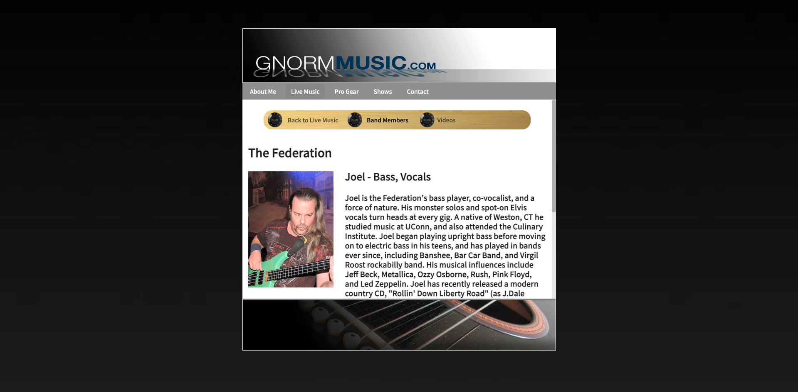

# Gnorm Music LLC Company Site

A new version of local CT musician's (Gnorm) company website, rebuilt with the React.js library. (Note: Site has not yet been optimized for mobile/tablet screen views. Viewing is highly recommended for most computer/monitor screens.)

## Motivation

Gnorm is a locally well-known freelance musician in the southern CT area, and he approached me to recreate his website with more modern technologies, such as React.js, for the original had become outdated.

## Code Style

  

  <a href="#features">Features</a> •
  <a href="#technologies-used">Technologies Used</a> •
  <a href="#credits">Credits</a>

## Features

* The Live Music page features the bands that Gnorm plays with the most. Each band has its own page with a list of the members, complete with pictures, a list of their roles in the band, and a short bio to give prospective clients a sense of who they are.

* In addition, some of the bands featured also have a page for video examples of their live performances. So even if their background/personalities haven't made an impression, perhaps their playing will. (Only "Outside Chance" and "The Federation" have video examples at this time, other bands such as "DNR" will be updated in the future if provided.)

* The Pro Gear page features various musical equipment brands that Gnorm has used over the years and highly recommends to any aspiring musician.

* Each brand has its own informative entry detailing Gnorm's experience with it, including model specifics and potential utilities for live performances. A link for each brand is also provided if the user would like to research further.

* Lastly, the Shows page lists the current set of live performance dates for that month. This will be updated on a monthly basis at the very least, with minor updates later in the month if Gnorm receives a new gig date out of the blue. (Pictures/locations for venues will be provided with each entry, excluding private events.)

## Technologies Used

- [React.js](https://reactjs.org/)
- Semantic UI React: https://react.semantic-ui.com/
- [Express.js](https://expressjs.com)
- [Node.js](https://nodejs.org/en/)

## Credits

- James Geib:
    - Front-end Development
    - Front-end Design
    - Back-end Server
    - GitHub: https://github.com/jpgeib
    - LinkedIn: https://www.linkedin.com/in/james-geib-0b6493160